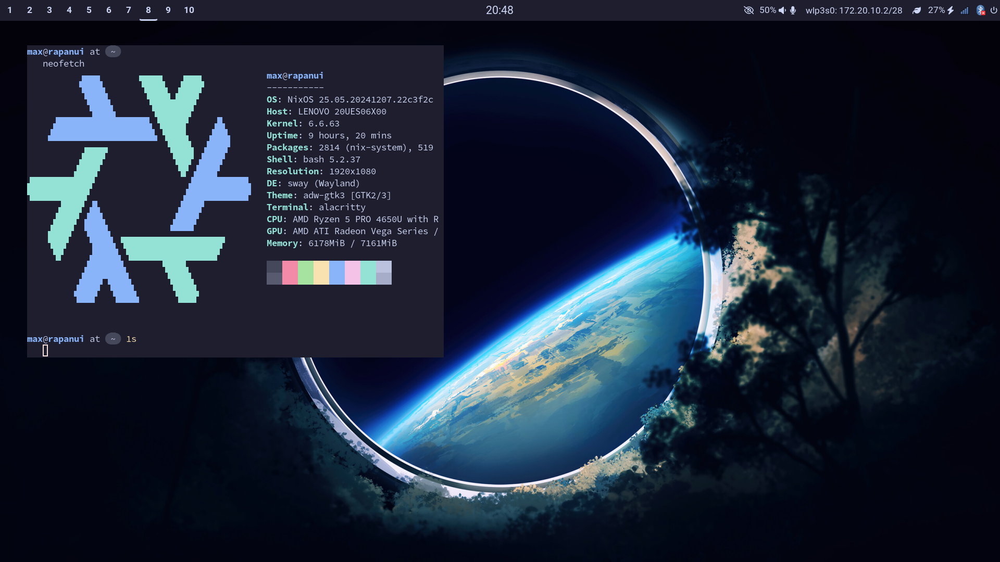

# The Big Nix Adventure

Nix is cool stuff, this is my attempt at making the grand-unifying-config. This
is the current look of my system.



This nix flake fully defines the nixos configuration for multiple systems that I
use on a daily basis. It currently uses the Sway wayland compositor, waybar,
rofi to launch applications, and smaller pieces like clipman to manage the
clipboard. My preferred workflow uses alacritty as terminal emulator, the zellij
terminal multiplexer and nvim to edit stuff. Configuration for everything can be
found in their eponymous `nix` files, or in the [dotfiles] submodule in their
original configuration language. Take a look there if you want to see my `nvim`
config.

### How to use this?

If you would like to try out this system, clone this flake and run `just help`.
This will invoke the `Just` command runner to give an overview of possibly
useful commands. 

To build just run `just`. 

In case you want to specify which system to build run `sudo nixos-rebuild switch --flake {path/to/flake.nix}#{flake_output_you_want}`.

I.E. building the `rapanui` nixos
configuration is done using `sudo nixos-rebuild switch --flake .#rapanui`.

### Can I steal this?

Ofcourse 😉

### Notes on Design

Before this adventure I was managing my dotfiles as a bare git repository
deployed to `$HOME`. This works very well, but is a bit tedious to sync to new
machines. Then I fell into this nix rabbit hole.

Nix likes to manage everything. I want to keep some of my dotfiles in their
original language, because searching for information is easier that way. Also
I also want to be able
to edit my neovim configuration without having to rebuild my system.

To fix this I'm using `(config.lib.file) mkOutOfStoreSymlink` to make symlinks to
various configuration files.
This allows my dotfiles to live
as a submodule of this repository in their original language, and does not
require a rebuild when I make a nvim config change.
Make sure to pass an absolute path to it when using a nix flake, or run with
`--impure`.

For more info see:
https://www.reddit.com/r/NixOS/comments/108fwwh/tradeoffs_of_using_home_manager_for_neovim_plugins/
https://github.com/nix-community/home-manager/issues/257#issuecomment-831300021

I have chosen to install `home-manager` as a nixos module instead of standalone. I
thought it would be most simple if a `nix` file for `bash` would contain all
configuration required for a functional `bash` setup. I might revisit this
decision if I'm actively using MacOS or WSL in the future.

### Never ending list of things I still want to try

- nvim: mini.files et al

- nvim: fzf.lua

- nvim: try out [perfanno](https://github.com/t-troebst/perfanno.nvim)

- Separate nixos and home-manager flake outputs, so this can be more easily
used in WSL/MacOS

- fix live boot medium output

- Nas/homelab server setup

- switch to grub?

- setup disko?

- setup impermanence?


### This is the stuff I always forget:

```bash
# Build ISO image
nix build ~/git/nix#iso
# optionally format the usb
lsblk
sudo umount /dev/sda
sudo mkfs.vfat -F 32 /dev/sda
# flash it to usb
cp result/iso/LiveNix.iso /dev/sda
# or, if you hate ergonomics
dd if=result/iso/LiveNix.iso of=/dev/sda bs=4M status=progress conv=fdatasync

# How to access nixos config in home-manager?
# https://github.com/nix-community/home-manager/issues/393
{ osConfig, ... }

# Manage SOPS
## generate new key at ~/.config/sops/age/keys.txt
nix shell nixpkgs#age -c age-keygen -o ~/.config/sops/age/keys.txt

## generate new key at ~/.config/sops/age/keys.txt from private ssh key at ~/.ssh/private
nix run nixpkgs#ssh-to-age -- -private-key -i ~/.ssh/private > ~/.config/sops/age/keys.txt

## get a public key of ~/.config/sops/age/keys.txt
nix shell nixpkgs#age -c age-keygen -y ~/.config/sops/age/keys.txt

```

[dotfiles]: https://github.com/MaxKiv/dotfiles

